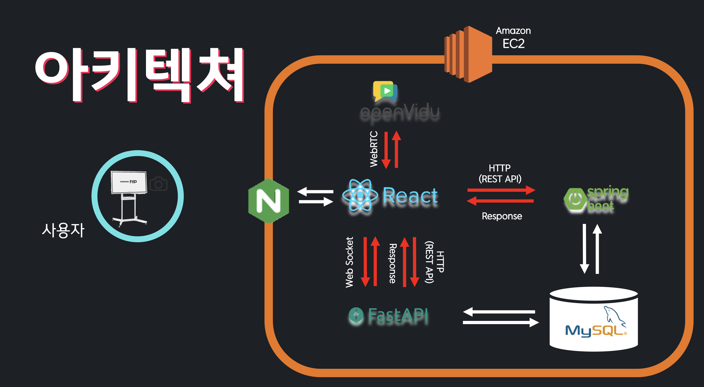
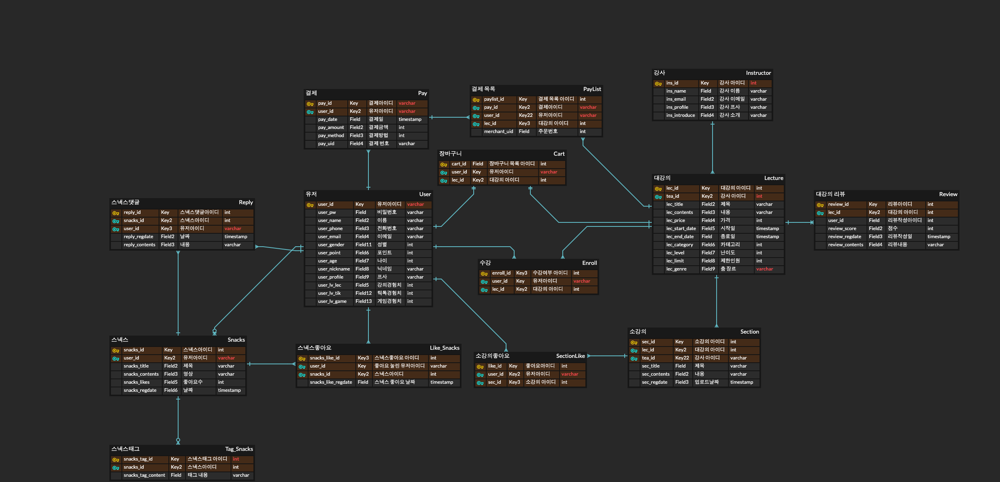
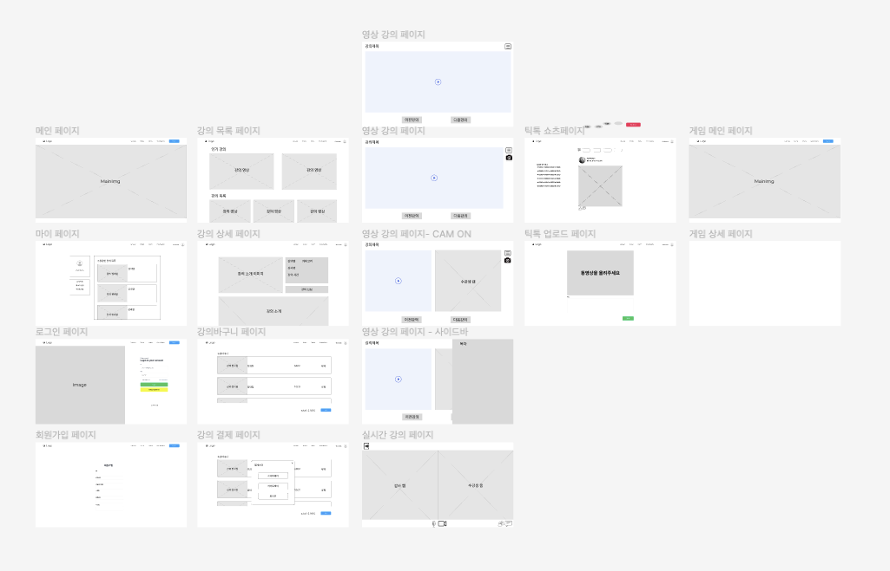
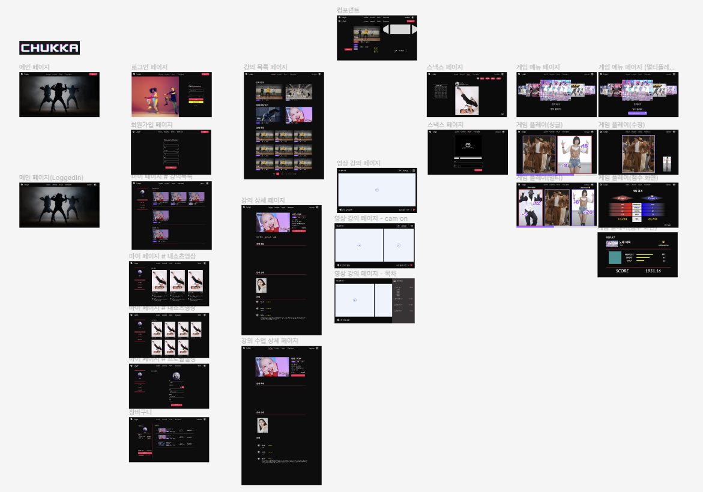

# Chukka (통합 춤 플랫폼)

> 춤을 배우고, 춤을 공유하며, 춤추며 노는 플랫폼

## 주요 기능

### 강의

- WebRTC 기술을 활용한 라이브 강의
- 웹캠 및 영상을 활용한 녹화강의
- 리뷰 기능

### 게임

- Python Tensorflow의 Pose Estimation 활용하여 동작 유사도 측정
- 게임 음악 선택 및 유사도에 따른 점수 획득

### 스낵스

- 짧은 댄스 영상 공유
- 해쉬태그, 좋아요와 댓글을 통한 소통

# ⚙️ 시스템 환경 및 구성

## 시스템 환경

- Cloud Server : AWS EC2
- OS : Ubuntu 20.04 LTS (GNU/Linux 5.4.0-1018-aws x86_64)
- CPU 모델 : Intel(R) Xeon(R) CPU E5-2686 v4 @ 2.30GHz
- 전체 core 수 : 4 | cpu 당 물리코어 : 4

## 시스템 구성

- nginx (1.18.0 (Ubuntu))
- gunicorn (version 20.0.4)

## 개발 환경

- Front
  - Node.js 16.16.0
  - React 17.0.2
  - React-Redux 8.0.2
  - Redux-Toolkit 1.8.3
  - React-Router-Dom 6.3.0
- Back
  - Spring Boot 2.7.2
  - Spring Framework 5.3.22
  - FastAPI 0.79
- DB
  - MySQL 8.0.29
- WebRTc
  - openVidu
- IDE
  - vscode 1.70
  - IntelliJ 2022.1.3
- 형상관리
  - Git

## 협업 툴

- Git
- Jira
- Notion
- Webex
- Mattermost

# 서비스 아키텍처



# 데이터 설계

## ERD



# 와이어프레임 및 프로토타입

## 와이어프레임



## 프로토타입



# Git 컨벤션 및 브랜치 전략

## Git 컨벤션

- gitmessages.txt 활용
- 이모지를 활용하여 커밋 종류 표현

`gitmessage.txt`

```
################
# <이모지> <제목> 의 형식으로 제목을 아래 공백줄에 작성
# 제목은 50자 이내 / 변경사항이 "무엇"인지 명확히 작성 / 끝에 마침표 금지
✨ 커밋 제목

# 바로 아래 공백은 지우지 마세요 (제목과 본문의 분리를 위함)

################
# 본문(구체적인 내용)을 아랫줄에 작성
# 여러 줄의 메시지를 작성할 땐 "-"로 구분 (한 줄은 72자 이내)
- 내용 1
- 내용 2
################
# 꼬릿말(footer)을 아랫줄에 작성 (현재 커밋과 관련된 이슈 번호 추가 등)
# Jira Smart commit 사용 시 Jira 이슈 또한 종료할 수 있음.
# 예) Close #7

################
# ✨ : 새로운 기능 추가
# 🐛 : 버그 수정
# 📚 : 문서 수정
# 🚨 : 테스트 코드 추가
# 🔨 : 코드 리팩토
# 📝 : 코드 의미에 영향을 주지 않는 변경사항
# 🔧 : 기타 변경사항, 프로`덕션 코드 변경사항 없음
################
```

## MR 템플릿

```
## 어떤 이유로 MR를 하셨나요?
- [ ] feature 병합(feature issue #를 남겨주세요)
- [ ] 버그 수정(아래에 issue #를 남겨주세요)
- [ ] 코드 개선
- [ ] 기타(아래에 자세한 내용 기입해주세요)

## 스크린샷 및 세부 내용 - 왜 해당 MR이 필요한지 자세하게 설명해주세요
- 세부사항을 항목으로 설명해주세요

## MR하기 전에 확인해주세요
- [ ] local code lint 검사를 진행하셨나요?
- [ ] local ci test를 진행하셨나요?

## relavant issue number
- 관련된 이슈 넘버가 있으면 이곳에 기입해주세요
```

## 브랜치 전략

- Git Flow 브랜치 전략 사용

```
|-- master

    |-- develop/front
        |-- feature/front/feature1
        |-- feature/front/feature2

    |-- develop/back
        |-- feature/back/feature1
        |-- feature/back/feature2

    |-- develop/embedded
        |-- feature/embedded/feature1
        |-- feature/embedded/feature2
```

# Chukka 팀원 소개 및 역할

### Embedded

- 김수진(팀장)

- 이연의

### Backend

- 김대영

- 최지원

### Frontend

- 윤호준

- 홍성목
